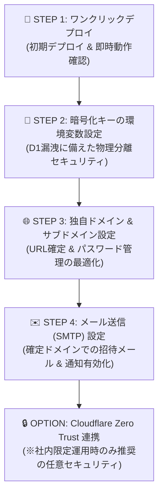

# 💼 CoHive Enterprise Edition

[](./LICENSE)

維持費0円から運用できる、Cloudflare完全ネイティブの**マルチ組織（マルチテナント）・ガバナンス統合管理エディション**。

> 🌐 **[English README is available here](./README.md)**

---

## 🌟 主な機能

* 🏢 **マルチテナント統合管理コンソール**: 複数組織（クライアント・部署）のD1データベースやドメインルーティングを一括生成・管理。
* 🔐 **親管理者権限 & ガバナンス**: テナントごとのリソース制限（`SAAS_LIMITS`）、サスペンド（一時停止）、MFA（2段階認証）対応の管理者認証、全体アナウンス配信。
* 📊 **監査ログ機能 (Audit Logs)**: ワークスペース内の操作・アクセスログの一元管理。  
  * ※直近7日間の監査ログ閲覧は標準でどなたでもご利用いただけます。  
  * 💖 **[スポンサー限定・今後提供予定]**: **7日以前（7日より前）の過去監査ログの保持・確認** は今後スポンサー特典機能として提供予定です（現在検証・順次実装中）。
* 🌐 **ハイブリッドルーティング**: デフォルトのパス指定ルーティング（`/w/tenant`）と、独自ドメインによる完全サブドメイン分離（`tenant.domain.com`）の自動切り替え。
* 🔑 **暗号化キー物理分離セキュリティ**: `ENCRYPTION_SECRET` 環境変数を使用し、D1漏洩時にも機密データ（SMTP情報等）を解読不能にする物理分離設計。
* 💳 **Stripe 課金・決済連携 (開発中 / 今後対応予定)**: Stripe Checkout による有料プラン自動決済、Webhook連動、および契約管理ポータル連携（現在開発・検証中）。

---

## 🛠️ デプロイ方法 (Deploy Guide)

### 1. デプロイボタンをクリックする
以下の「Deploy to Cloudflare Pages」ボタンをクリックします。

[](https://deploy.workers.cloudflare.com/?url=https://github.com/cohive-tms/cohive-cloudflare)

> 💡 **自動アップデート機能について**  
> ワンクリックデプロイで作成された環境には、本家の修正や新機能を毎日自動で同期・再デプロイする GitHub Actions が含まれているため、**公開後も完全放置で常に最新状態へアップデート**されます。  
> 
> **※自動アップデートを行いたくない場合（手動でコード管理やバージョン管理を行いたい場合）**  
> ボタンを押さず、本リポジトリをご自身のアカウントに **`Fork`**（または `Use this template`）してデプロイしてください。その際、自動更新を止めるためにリポジトリ内の `.github/workflows/auto-sync.yml` ファイルを削除（または GitHub の Actions タブで Disable に設定）してください。

---

## 📘 段階的セットアップマニュアル (Setup Guide)

本ガイドでは、**CoHive Enterprise Edition (マルチ組織・ガバナンス管理版)** をデプロイし、初期状態から本番運用・エンタープライズ運用へスムーズにステップアップするための手順を解説します。

### 🗺️ 段階的セットアップのロードマップ



---

### 🚀 STEP 1: ワンクリックデプロイ（お試し・即時起動）

まずは一番手軽な方法でアプリを起動し、動作確認を行います。

1. **デプロイボタンの実行**  
   上記の [Deploy to Cloudflare] ボタンをクリックし、表示される案内に従ってデプロイを完了させます。
2. **自動生成リソース**  
   Pages Functions、D1データベース（`cohive_saas_db`）、R2ストレージバケットが自動的にプロビジョニングされます。
3. **即時アクセスと動作確認**  
   発行されたデフォルトドメイン（例: `https://xxx.pages.dev`）にアクセスします。
   * **動作仕様**: 独自ドメイン未設定の状態では、パス指定形式（例: `https://xxx.pages.dev/w/tenant-a/login`）で**何の手動設定もなく即座にマルチテナント機能が動作**します。

---

### 🔑 STEP 2: 暗号化キーの環境変数設定（物理分離セキュリティ）

万が一**D1データベース全体が丸ごと漏洩（ダンプ）された場合のリスクを完全に排除**するため、暗号化キーをCloudflare Workersの環境変数（Secrets）に分離保存することを強く推奨します。

1. **設定手順**:
   * Cloudflare ダッシュボード > **Workers & Pages** > デプロイした Pages プロジェクトを選択。
   * **「設定 (Settings)」 > 「環境変数 (Environment Variables)」** に進みます。
   * 変数追加で以下を設定して保存・再デプロイします：
     - **変数名**: `ENCRYPTION_SECRET`
     - **値**: 32バイト以上のランダムな暗号化用文字列（例: `openssl rand -hex 32` などで生成した文字列）
     - **タイプ**: `Secret (暗号化)`

> 💡 **物理分離の効果**  
> これにより「データベース」と「復号キー」が物理的に別々の場所に管理されるため、仮にD1データベースが流出しても、テナントごとのSMTPパスワード等の機密情報が解読されることは**絶対にありません**。

---

### 🌐 STEP 3: 独自ドメイン & サブドメイン設定（本番運用推奨）

パスワードマネージャー（Chrome/1Password等）の混同防止や、ブランディング最適化のために独自ドメインを設定します。

1. **Cloudflare DNSでワイルドカードを設定**
   * お持ちのドメイン（例: `yourdomain.com`）のCloudflare DNS管理画面で、以下のCNAMEレコードを1つ追加します。
     * **Type**: `CNAME`
     * **Name**: `*` （全サブドメインを対象化）
     * **Target**: `xxx.pages.dev`（STEP 1で生成されたURL）
     * **Proxy status**: 🟧 プロキシON
2. **Pagesプロジェクトにカスタムドメインをバインド**
   * Cloudflare Pages の「カスタムドメイン」設定から `yourdomain.com` および `*.yourdomain.com` を追加します。
3. **自動昇格（サブドメイン方式）**
   * これにより、テナント「A社」のログイン画面が `https://tenant-a.yourdomain.com` としてアクセス可能になり、ブラウザの自動入力事故やユーザーの視覚的混乱が解消されます。

---

### ✉️ STEP 4: メール送信設定 (SMTP)

ドメイン確定後、招待メールやオフライン通知を送信するためのSMTPサーバー情報を設定します。

1. **管理コンソールへのログイン**  
   親管理者アカウントで管理画面（`https://yourdomain.com/admin`）にログインします。
2. **SMTP情報の入力**  
   「システム設定」>「メール送信設定」から、以下の情報を入力します。
   * **SMTPホスト**: (例: `smtp.sendgrid.net` または 自社メールサーバー)
   * **ポート**: `587` または `465`
   * **差出人メールアドレス**: `noreply@yourdomain.com`（STEP 3で確定したドメイン）
   * **認証情報**: ユーザー名 & パスワード/APIキー
3. **動作確認**  
   テストメール送信を行い、テナント招待メールが正常に届くか確認します。

---

### 🔒 OPTION: Cloudflare Zero Trust (Access) 連携

> ⚠️ **ご注意**: Cloudflare Zero Trust は、**社内メンバー限定で利用する場合のみ有効化してください**。社外クライアントやオープンコミュニティ等、不特定多数に開放する用途では二重ログインとなり利便性を損ねるため**不要**です。

#### 設置手順（完全社内限定運用の場合）

1. **Cloudflare Dashboard** から **Zero Trust** > **Access** > **Applications** に進みます。
2. **Add an Application** を選択し、`Self-hosted` を選択。
3. **Domain**: `yourdomain.com` （または特定のサブドメイン）を指定。
4. **Identity Providers**: Google Workspace, Microsoft Entra ID, GitHub などのSSO認証をバインド。
5. **Policy**: 許可するメールアドレスドメイン（例: `@yourcompany.com`）を指定して保存。

これて、アプリケーションの手前に社内SSO認証ゲートが設置され、許可された社内人間しかアクセスできない二重防御が完了します。

---

## 🛠️ ローカル開発環境のセットアップ

```bash
# クローン
git clone https://github.com/cohive-tms/cohive-cloudflare.git
cd cohive-cloudflare

# 依存関係インストール
npm install

# ローカル開発サーバー起動
npm run dev
```

---

## 📄 ライセンス & スポンサー (License & Sponsorship)

本リポジトリは **[Apache License 2.0](./LICENSE)** のもとでオープンソースとして公開されています。詳細なライセンス条件については [LICENSE](./LICENSE) をご確認ください。

### 💖 GitHub Sponsors について
cohive プロジェクトの開発および継続的なメンテナンスを支えていただき、心より感謝申し上げます！
* **スポンサー限定特典 (今後提供予定)**:
  * 7日以前（過去7日より前）の監査ログ保持・閲覧機能の有効化（現在検証・順次実装予定）
  * 優先サポートおよび最新機能のアーリーアクセス

スポンサー登録・詳細については [GitHub Sponsors](https://github.com/sponsors/cohive-tms) をご覧ください。
