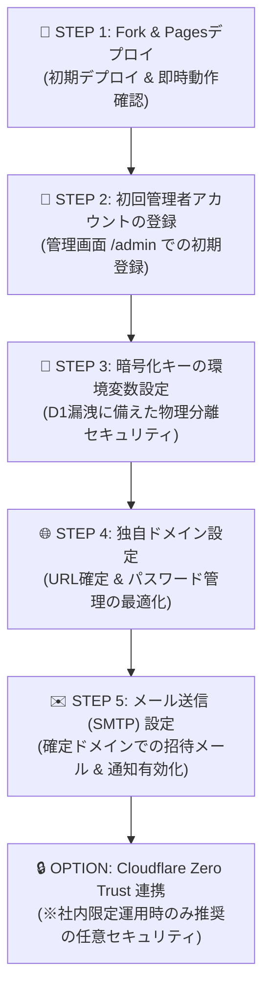

# 💼 CoHive

[](./LICENSE)

維持費0円から運用できる、Cloudflare完全ネイティブの**マルチテナント対応ワークスペース管理プラットフォーム**。

> 🌐 **[English README is available here](./README.md)**

---

## 🌟 主な機能

* 🏢 **マルチテナント統合管理コンソール**: 複数組織（クライアント・部署）のD1データベースやドメインルーティングを一括生成・管理。
* 🔐 **親管理者権限 & ガバナンス**: テナントごとのリソース制限（`SAAS_LIMITS`）、サスペンド（一時停止）、MFA（2段階認証）対応の管理者認証、全体アナウンス配信。
* 📊 **監査ログ機能 (Audit Logs)**: ワークスペース内の操作・アクセスログの一元管理。  
  * ※直近7日間の監査ログ閲覧は標準でどなたでもご利用いただけます。  
  * 💖 **[スポンサー限定・今後提供予定]**: **7日以前（7日より前）の過去監査ログの保持・確認** は今後スポンサー特典機能として提供予定です（現在検証・順次実装中）。
* 🌐 **独自ドメイン対応**: Cloudflare Pagesに独自のドメインをバインドして運用可能。
* 🔑 **暗号化キー物理分離セキュリティ**: `ENCRYPTION_SECRET` 環境変数を使用し、D1漏洩時にも機密データ（SMTP情報等）を解読不能にする物理分離設計。
* 💳 **Stripe 課金・決済連携 (開発中 / 今後対応予定)**: Stripe Checkout による有料プラン自動決済、Webhook連動、および契約管理ポータル連携（現在開発・検証中）。

---

## 🛠️ デプロイ方法 (Deploy Guide)

> 💡 **まず試してみたい方へ**
> 本番デプロイを行う前にシステムの動作を確認したい場合は、[CoHive デモサイト（現在準備中）](#) をご利用ください。

CoHiveをセルフホスト（自身の環境へ導入）するには、リポジトリの **Fork** と **Cloudflare Pages** の連携が推奨されます。これにより、後からブラウザ上の操作だけで安全・簡単に最新バージョンへアップデートできます。

### 1. リポジトリを Fork する
1. GitHub上の画面右上の **[Fork]** ボタンをクリックし、ご自身のアカウントにリポジトリをコピー（Create fork）します。

### 2. Cloudflare Pages へのデプロイ
1. [Cloudflare ダッシュボード](https://dash.cloudflare.com/) にログインし、**[Workers & Pages]** ＞ **[作成]** ＞ **[Pages]** ＞ **[Git に接続]** を選択します。
2. 先ほど Fork したご自身のリポジトリ（`cohive-cloudflare`）を選択し、**[セットアップの開始]** をクリックします。
3. ビルド設定や環境変数の入力画面が表示されますが、**設定は何も変更せず（すべてデフォルトのまま）** ページ最下部の **[保存してデプロイ]** をクリックします。これで自動ビルドとプロビジョニングが開始されます。

---

## 🔄 アップデート方法 (Update Guide)

管理者画面（`/admin`）に新しいバージョンのお知らせが表示された場合は、以下の手順で安全に最新状態へ更新できます。

1. ご自身のGitHubのForkリポジトリページを開きます。
2. コード一覧の上部にある **[Sync fork]** ＞ **[Update branch]** ボタンをクリックします。
3. リポジトリが更新されると、Cloudflare Pagesが自動的に更新を検知して再デプロイを開始し、数分で最新状態が反映されます。

---

## 📘 段階的セットアップマニュアル (Setup Guide)

本ガイドでは、**CoHive** をデプロイし、初期状態から本番運用へスムーズにステップアップするための手順を解説します。

### 🗺️ 段階的セットアップのロードマップ



---

### 🚀 STEP 1: Fork & Pagesデプロイ（初期デプロイ & 動作確認）

1. **初期デプロイの完了**  
   上記の「デプロイ方法」に従って、リポジトリのForkとCloudflare Pagesへのデプロイを完了させます。
2. **自動生成リソース**  
   デプロイ完了時にPages Functions、D1データベース（`cohive_db`）、R2ストレージバケットが自動的にプロビジョニングされます。
3. **即時アクセスと動作確認**  
   発行されたデフォルトドメイン（例: `https://xxx.pages.dev`）にアクセスします。
   * **動作仕様**: 独自ドメイン未設定の状態では、デフォルトで提供される pages.dev ドメインを使用して即座にマルチテナント機能が動作します。

---

### 👑 STEP 2: 初回管理者アカウントの登録（初期セットアップ）

デプロイ直後は、プラットフォーム運営者（Super Admin）アカウントが未登録の状態です。この状態では一般ユーザー向けトップページ（`/`）を開くと **「システム準備中」** 画面が表示されます。

1. **管理画面（`/admin`）にアクセス**  
   発行されたドメインの末尾に `/admin` を指定してアクセスします。  
   *(例: `https://xxx.pages.dev/admin` または `https://yourdomain.com/admin`)*
2. **最初の管理者を登録**  
   「CoHive Admin Setup」画面が表示されるので、表示名・メールアドレス・初期パスワードを入力して **「最初の管理者を登録」** ボタンを押します。
3. **セットアップ完了**  
   登録完了後、管理者ダッシュボードが表示され、プラットフォーム全体の基本セットアップが完了します。これ以降、一般ユーザー向けのチャット・ワークスペース作成機能が開講されます。

---

### 🔑 STEP 3: 暗号化キーの環境変数設定（物理分離セキュリティ）

万が一**D1データベース全体が丸ごと漏洩（ダンプ）された場合のリスクを完全に排除**するため、暗号化キーをCloudflare Workersの環境変数（Secrets）に分離保存することを強く推奨します。

1. **設定手順**:
   * Cloudflare ダッシュボード > **Workers & Pages** > デプロイした Pages プロジェクトを選択。
   * **「設定 (Settings)」 > 「環境変数 (Environment Variables)」** に進みます。
   * 変数追加で以下を設定して保存・再デプロイします：
     - **変数名**: `ENCRYPTION_SECRET`
     - **値**: 32バイト以上のランダムな暗号化用文字列（例: `openssl rand -hex 32` などで生成した文字列）
     - **タイプ**: `Secret (暗号化)`

> 💡 **物理分離の効果**  
> これにより「データベース」と「復号キー」が物理的に別々の場所に管理されるため、仮にD1データベースが流出しても、テナントごとのSMTPパスワード等の機密情報が解読されることは**絶対にありません**。

---

### 🌐 STEP 4: 独自ドメイン設定（本番運用推奨）

ブランディング最適化のために独自ドメインを設定します。

1. **Cloudflare DNSでCNAMEを設定**
   * お持ちのドメイン（例: `yourdomain.com` または `cohive.yourdomain.com`）のCloudflare DNS管理画面で、以下のCNAMEレコードを1つ追加します。
     * **Type**: `CNAME`
     * **Name**: `@` （または `cohive` などのサブドメイン名）
     * **Target**: `xxx.pages.dev`（STEP 1で生成されたURL）
     * **Proxy status**: 🟧 プロキシON
2. **Pagesプロジェクトにカスタムドメインをバインド**
   * Cloudflare Pages の「カスタムドメイン」設定から、設定したカスタムドメイン（例: `cohive.yourdomain.com`）を追加します。

---

### ✉️ STEP 5: メール送信設定 (SMTP)

ドメイン確定後、招待メールやオフライン通知を送信するためのSMTPサーバー情報を設定します。

1. **管理コンソールへのログイン**  
   親管理者アカウントで管理画面（`https://yourdomain.com/admin`）にログインします。
2. **SMTP情報の入力**  
   「システム設定」>「メール送信設定」から、以下の情報を入力します。
   * **SMTPホスト**: (例: `smtp.sendgrid.net` または 自社メールサーバー)
   * **ポート**: `587` または `465`
   * **差出人メールアドレス**: `noreply@yourdomain.com`（STEP 4で確定したドメイン）
   * **認証情報**: ユーザー名 & パスワード/APIキー
3. **動作確認**  
   テストメール送信を行い、テナント招待メールが正常に届くか確認します。

---

### 🔒 OPTION: Cloudflare Zero Trust (Access) 連携

> ⚠️ **ご注意**: Cloudflare Zero Trust は、**社内メンバー限定で利用する場合のみ有効化してください**。社外クライアントやオープンコミュニティ等、不特定多数に開放する用途では二重ログインとなり利便性を損ねるため**不要**です。

#### 設置手順（完全社内限定運用の場合）

1. **Cloudflare Dashboard** から **Zero Trust** > **Access** > **Applications** に進みます。
2. **Add an Application** を選択し、`Self-hosted` を選択。
3. **Domain**: `yourdomain.com` （または特定のサブドメイン）を指定。
4. **Identity Providers**: Google Workspace, Microsoft Entra ID, GitHub などのSSO認証をバインド。
5. **Policy**: 許可するメールアドレスドメイン（例: `@yourcompany.com`）を指定して保存。

これて、アプリケーションの手前に社内SSO認証ゲートが設置され、許可された社内人間しかアクセスできない二重防御が完了します。

---

## 🛠️ ローカル開発環境のセットアップ

```bash
# クローン
git clone https://github.com/cospace-tms/cospace-cloudflare.git
cd cohive-cloudflare

# 依存関係インストール
npm install

# ローカル開発サーバー起動
npm run dev
```

---

## 📄 ライセンス & スポンサー (License & Sponsorship)

本リポジトリは **[Apache License 2.0](./LICENSE)** のもとでオープンソースとして公開されています。詳細なライセンス条件については [LICENSE](./LICENSE) をご確認ください。

### 💖 GitHub Sponsors について
cohive プロジェクトの開発および継続的なメンテナンスを支えていただき、心より感謝申し上げます！
* **スポンサー限定特典 (今後提供予定)**:
  * 7日以前（過去7日より前）の監査ログ保持・閲覧機能の有効化（現在検証・順次実装予定）
  * 優先サポートおよび最新機能のアーリーアクセス

スポンサー登録・詳細については [GitHub Sponsors](https://github.com/sponsors/cohive-tms) をご覧ください。
