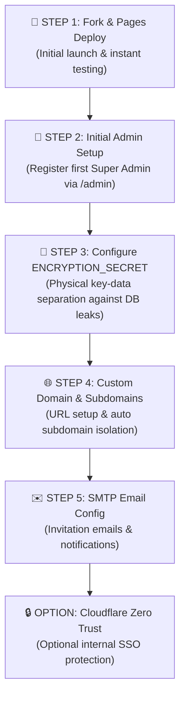

# 💼 CoHive

[](./LICENSE)

**Zero-maintenance Cloudflare native multi-tenant workspace management, governance suite, and administration portal for CoHive.**

> 🇯🇵 **[日本語ドキュメント・READMEはこちら](./README.ja.md)**

---

## 🌟 Features

* 🏢 **Multi-Tenant Administration**: Manage multiple workspace instances, D1 databases, R2 storage, and custom domain routing from a unified admin dashboard.
* 🔐 **Super Admin Governance**: Admin management for tenant provisioning, resource limits (`SAAS_LIMITS`), workspace suspension, MFA (2-Factor Authentication) login protection, and system-wide announcements.
* 📊 **Audit Log Management**: Centralized tracking of workspace actions and user access.  
* 🌐 **Custom Domain Support**: Easily bind your custom domain to your Cloudflare Pages deployment.
* 🔑 **Physical Key Separation Security**: Protects against D1 database leakage using the `ENCRYPTION_SECRET` environment variable to isolate sensitive data (SMTP credentials, etc.) from storage.

---

## 🛠️ Deployment Guide

> 💡 **Want to try it out first?**
> If you'd like to test the system before deploying your own instance, please use the [CoHive Demo Site (Coming Soon)](#).

To self-host CoHive, it is highly recommended to **Fork** this repository and deploy it via **Cloudflare Pages**. This setup allows you to easily update your instance to the latest version with a single click.

### 1. Fork the Repository
1. Click the **[Fork]** button at the top-right of this page and copy the repository to your own GitHub account (Create fork).

### 2. Deploy to Cloudflare Pages
1. Log in to the [Cloudflare Dashboard](https://dash.cloudflare.com/).
2. Navigate to **[Workers & Pages]** ＞ **[Create]** ＞ **[Pages]** ＞ **[Connect to Git]**.
3. Select your Forked repository (`cohive-cloudflare`) and click **[Begin setup]**.
4. On the configuration screen, **do not change any settings (leave everything as default)** and click **[Save and Deploy]** at the bottom of the page. This will start the automated build.

---

## 🔄 Update Guide

When a new version alert appears on your admin dashboard (`/admin`), you can update your instance easily and safely using these steps:

1. Open your Forked repository page on GitHub.
2. Click **[Sync fork]** ＞ **[Update branch]** at the top of the file list.
3. Once updated, Cloudflare Pages will automatically detect the changes and trigger a re-deployment. Your app will be updated to the latest version within a few minutes.

---

## 📘 Step-by-Step Setup Guide

This guide walks you through deploying **CoHive** and stepping up from initial trial to full production.

### 🗺️ Setup Roadmap



---

### 🚀 STEP 1: Fork & Pages Deploy (Initial Deployment)

1. **Complete Initial Deployment**  
   Follow the "Deployment Guide" above to Fork the repository and deploy it to Cloudflare Pages.
2. **Auto-provisioned Resources**  
   Pages Functions, D1 database (`cohive_db`), and R2 storage bucket are created automatically.
3. **Instant Access & Verification**  
   Access your generated default URL (e.g., `https://xxx.pages.dev`).
   * **Behavior**: Without custom domain configuration, the application works out of the box using your default pages.dev domain.

---

### 👑 STEP 2: Initial Admin Setup via `/admin`

Immediately after deployment, no platform Super Admin account exists. Accessing the main domain (`/`) will display a **"System Preparing"** screen until initial configuration is complete.

1. **Access Admin Portal (`/admin`)**  
   Append `/admin` to your generated domain URL in the browser.  
   *(e.g., `https://xxx.pages.dev/admin` or `https://yourdomain.com/admin`)*
2. **Register First Super Admin**  
   You will be greeted by the **"CoHive Admin Setup"** screen. Enter your Display Name, Email, and Initial Password, then click **"Register First Admin"**.
3. **Complete Platform Initialization**  
   Upon successful registration, the admin console will load, completing platform initialization and unlocking general user access for workspaces and chat functions.

---

### 🔑 STEP 3: Configure ENCRYPTION_SECRET (Physical Key Separation)

To **completely eliminate the risk of decrypted credentials in the event of a full D1 database leak**, storing your encryption key in Cloudflare Workers environment variables (Secrets) is strongly recommended.

1. **Setup Steps**:
   * Go to Cloudflare Dashboard > **Workers & Pages** > Select your deployed Pages project.
   * Navigate to **Settings > Environment Variables**.
   * Click **Add variable** and configure:
     - **Variable name**: `ENCRYPTION_SECRET`
     - **Value**: A random 32+ byte secret string (e.g. generated via `openssl rand -hex 32`)
     - **Type**: `Secret (Encrypted)`

> 💡 **Physical Separation Benefit**  
> This physically separates the decryption key from the D1 database storage. Even if your D1 database is compromised, sensitive values like tenant SMTP passwords **cannot be decrypted**.

---

### 🌐 STEP 4: Custom Domain Configuration (Recommended for Production)

To optimize branding and use your own domain, bind a custom domain.

1. **Set CNAME Record in Cloudflare**
   * In your Cloudflare DNS manager for your domain (e.g., `yourdomain.com` or `cohive.yourdomain.com`), add a CNAME record:
     * **Type**: `CNAME`
     * **Name**: `@` (or subdomain like `cohive`)
     * **Target**: `xxx.pages.dev` (Your URL from STEP 1)
     * **Proxy status**: 🟧 Proxied
2. **Bind Custom Domain in Pages**
   * In Cloudflare Pages Custom Domains, add your custom domain (e.g., `cohive.yourdomain.com`).

---

### ✉️ STEP 5: SMTP Email Configuration

Configures outgoing email for workspace invitations and notifications.

1. **Log in to Admin Console**: Go to `https://yourdomain.com/admin` as Super Admin.
2. **Configure SMTP**: Under **System Settings** > **Email Settings**, enter:
   * **SMTP Host**: (e.g., `smtp.sendgrid.net` or your mail server)
   * **Port**: `587` or `465`
   * **Sender Email**: `noreply@yourdomain.com` (from domain configured in STEP 4)
   * **Credentials**: Username & Password / API Key
3. **Verify**: Send a test email to ensure invitation emails arrive properly.

---

### 🔒 OPTION: Cloudflare Zero Trust (Access) Integration

> ⚠️ **Note**: Enable Cloudflare Zero Trust **only if this instance is strictly for internal company use**. For open or multi-company client access, Zero Trust SSO creates unnecessary double-login barriers.

#### Setup Steps (Strictly Internal Organization Usage)

1. In Cloudflare Dashboard, go to **Zero Trust** > **Access** > **Applications**.
2. Select **Add an Application** > **Self-hosted**.
3. **Domain**: `yourdomain.com` (or specific subdomains).
4. **Identity Providers**: Bind Google Workspace, Microsoft Entra ID, GitHub, etc.
5. **Policy**: Allow your organization's domain (e.g., `@yourcompany.com`) and save.

---

## 🛠️ Repository Structure & Setup

```bash
# Clone repository
git clone https://github.com/cospace-tms/cospace-cloudflare.git
cd cohive-cloudflare

# Install dependencies
npm install

# Start local dev server
npm run dev
```

---

## 📄 License

This repository is licensed under the **[Apache License 2.0](./LICENSE)**. Please refer to the [LICENSE](./LICENSE) file for full terms and conditions.
