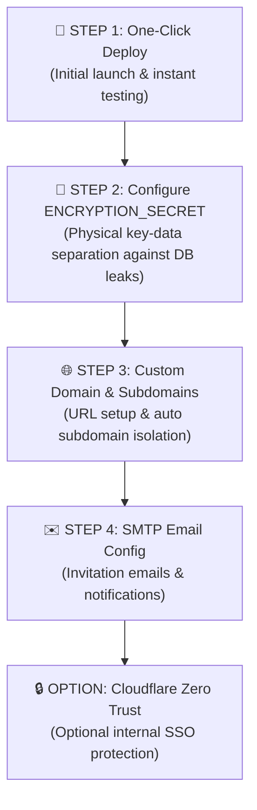

# 💼 CoHive

[](./LICENSE)

**Zero-maintenance Cloudflare native multi-tenant workspace management, governance suite, and administration portal for CoHive.**

> 🇯🇵 **[日本語ドキュメント・READMEはこちら](./README.ja.md)**

---

## 🌟 Features

* 🏢 **Multi-Tenant Administration**: Manage multiple workspace instances, D1 databases, R2 storage, and custom domain routing from a unified admin dashboard.
* 🔐 **Super Admin Governance**: Admin management for tenant provisioning, resource limits (`SAAS_LIMITS`), workspace suspension, MFA (2-Factor Authentication) login protection, and system-wide announcements.
* 📊 **Audit Log Management**: Centralized tracking of workspace actions and user access.  
  * ※ Viewing audit logs for the last 7 days is available to all users out of the box.  
  * 💖 **[Sponsor Feature - Planned]**: **Retention and viewing of audit logs older than 7 days** is planned as an upcoming GitHub Sponsor benefit (currently under verification).
* 🌐 **Hybrid Domain Routing**: Supports path-based routing (`/w/tenant`) by default and automatically upgrades to wildcard subdomains (`tenant.yourdomain.com`).
* 🔑 **Physical Key Separation Security**: Protects against D1 database leakage using the `ENCRYPTION_SECRET` environment variable to isolate sensitive data (SMTP credentials, etc.) from storage.
* 💳 **Stripe Billing Integration (In Progress / Upcoming Feature)**: Automated subscription plan management via Stripe Checkout, webhook synchronization, and customer portal integration (currently under active development and verification).

---

## 🛠️ One-Click Deployment

Click the button below to start deploying your instance:

[](https://deploy.workers.cloudflare.com/?url=https://github.com/cohive-tms/cohive-cloudflare)

> 💡 **Automatic Updates**  
> Repositories deployed via this button include a GitHub Actions workflow (`.github/workflows/auto-sync.yml`) that automatically syncs fixes and features from upstream daily, keeping your app **up-to-date automatically without manual action**.  
> 
> **※ Note for Manual Management:**  
> If you prefer to manage updates manually, please **`Fork`** (or `Use this template`) this repository first. To stop automatic updates, simply delete the `.github/workflows/auto-sync.yml` file (or disable it under the GitHub Actions tab) in your repository.

---

## 📘 Setup & Deployment Guide

This guide walks you through deploying **CoHive** and stepping up from initial trial to full production.

### 🗺️ Setup Roadmap



---

### 🚀 STEP 1: One-Click Deployment (Trial & Quick Launch)

1. **Run Deployment**  
   Click the **[Deploy to Cloudflare]** button above and follow the prompts.
2. **Auto-provisioned Resources**  
   Pages Functions, D1 database (`cohive_db`), and R2 storage bucket are created automatically.
3. **Instant Access & Verification**  
   Access your generated default URL (e.g., `https://xxx.pages.dev`).
   * **Behavior**: Without custom domain configuration, path-based multi-tenancy (`https://xxx.pages.dev/w/tenant-a/login`) works **out of the box with zero manual config**.

---

### 🔑 STEP 2: Configure ENCRYPTION_SECRET (Physical Key Separation)

To **completely eliminate the risk of decrypted credentials in the event of a full D1 database leak**, storing your encryption key in Cloudflare Workers environment variables (Secrets) is strongly recommended.

1. **Setup Steps**:
   * Go to Cloudflare Dashboard > **Workers & Pages** > Select your deployed Pages project.
   * Navigate to **Settings > Environment Variables**.
   * Click **Add variable** and configure:
     - **Variable name**: `ENCRYPTION_SECRET`
     - **Value**: A random 32+ byte secret string (e.g. generated via `openssl rand -hex 32`)
     - **Type**: `Secret (Encrypted)`

> 💡 **Physical Separation Benefit**  
> This physically separates the decryption key from the D1 database storage. Even if your D1 database is compromised, sensitive values like tenant SMTP passwords **cannot be decrypted**.

---

### 🌐 STEP 3: Custom Domain & Wildcard Subdomains (Recommended for Production)

To prevent password manager confusion and optimize branding, bind a custom domain.

1. **Set Wildcard DNS in Cloudflare**
   * In your Cloudflare DNS manager for your domain (e.g., `yourdomain.com`), add a CNAME record:
     * **Type**: `CNAME`
     * **Name**: `*` (Target all subdomains)
     * **Target**: `xxx.pages.dev` (Your URL from STEP 1)
     * **Proxy status**: 🟧 Proxied
2. **Bind Custom Domain in Pages**
   * In Cloudflare Pages Custom Domains, add `yourdomain.com` and `*.yourdomain.com`.
3. **Automatic Subdomain Upgrade**
   * Tenant "Company A" is now accessible at `https://tenant-a.yourdomain.com` with clean domain-isolated login and session security.

---

### ✉️ STEP 4: SMTP Email Configuration

Configures outgoing email for workspace invitations and notifications.

1. **Log in to Admin Console**: Go to `https://yourdomain.com/admin` as Super Admin.
2. **Configure SMTP**: Under **System Settings** > **Email Settings**, enter:
   * **SMTP Host**: (e.g., `smtp.sendgrid.net` or your mail server)
   * **Port**: `587` or `465`
   * **Sender Email**: `noreply@yourdomain.com` (from domain configured in STEP 3)
   * **Credentials**: Username & Password / API Key
3. **Verify**: Send a test email to ensure invitation emails arrive properly.

---

### 🔒 OPTION: Cloudflare Zero Trust (Access) Integration

> ⚠️ **Note**: Enable Cloudflare Zero Trust **only if this instance is strictly for internal company use**. For open or multi-company client access, Zero Trust SSO creates unnecessary double-login barriers.

#### Setup Steps (Strictly Internal Enterprise Usage)

1. In Cloudflare Dashboard, go to **Zero Trust** > **Access** > **Applications**.
2. Select **Add an Application** > **Self-hosted**.
3. **Domain**: `yourdomain.com` (or specific subdomains).
4. **Identity Providers**: Bind Google Workspace, Microsoft Entra ID, GitHub, etc.
5. **Policy**: Allow your organization's domain (e.g., `@yourcompany.com`) and save.

---

## 🛠️ Repository Structure & Setup

```bash
# Clone repository
git clone https://github.com/cohive-tms/cohive-cloudflare.git
cd cohive-cloudflare

# Install dependencies
npm install

# Start local dev server
npm run dev
```

---

## 📄 License & Sponsorship

This repository is licensed under the **[Apache License 2.0](./LICENSE)**. Please refer to the [LICENSE](./LICENSE) file for full terms and conditions.

### 💖 GitHub Sponsorship
Thank you to all of our sponsors supporting the continuous development and maintenance of cohive!
* **Sponsor Benefits (Upcoming)**:
  * Unrestricted access and retention for audit log history beyond 7 days (planned/under verification)
  * Priority support and early access to new features

For sponsorship details, please visit [GitHub Sponsors](https://github.com/sponsors/cohive-tms).
